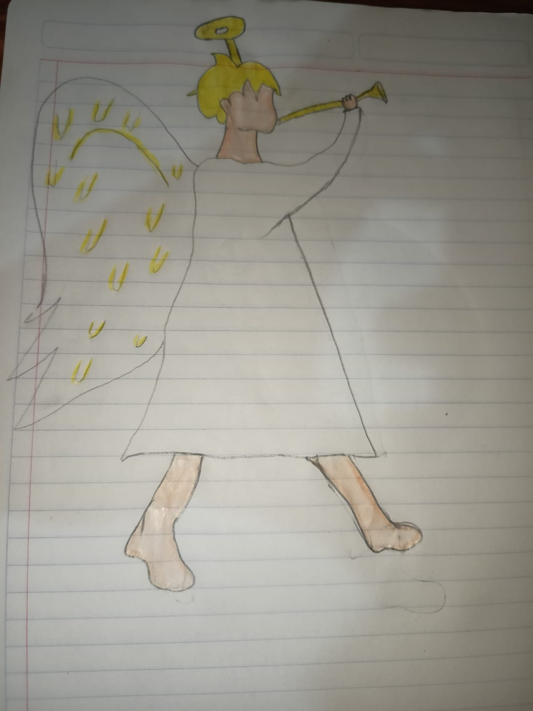
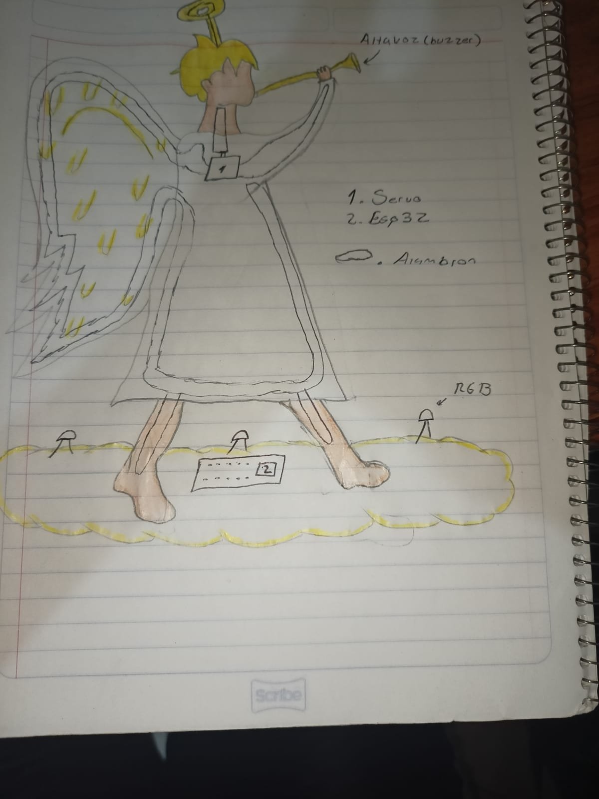

# Personaje_Navideno

## Nombre del Personaje
Angel con trompeta

## Materiales utilizados
|Nombre del componente | Descripción | Cantidad | Precio |
| - | - | - | - | 
|ESP32|Microcontrolador con comuncicación serial, wifi, bluetooth|1|$140.00|
|Cables Dupont|Cables MM HH MH para conexión de prototipos|50|$60.00|
|Tela|Tela de color blanco para vestimenta|1/2 m|$20|
|Servo|Motor que permite generar movimiento|1|$60|
|Alambron|Alambre que dará soporte al angel|1 m|$10|
|Muñeco|Extremidades para el angel|1|$60|
|Rollo de hilo blanco|Hilo para bordar extremidades y ropa|1|$10|
|Buzzer|Reproducira la melodia|1|$55|
|Foco RGB|Iluminar al angel|1|$15|
|Bolsa de algodon|Material para rellenar alas|1|$5|
|1 hoja de papel dorado|Material para aureola y trompeta|1|$3|

## Software utilizado
|Nombre de software|Versión|Tipo|
|-|-|-|
|Thonny|4.1.2|Software libre|
|SQLite|3|Software Libre|
|Visual Studio Code (Alternativa)|1.82|Software libre|
|MySQL|8.0|Software libre|

## Dibujo del prototipo a desarrollar

## Comunicación
-utilizaremos una placa ESP32 la cual ira conectada a un controlador, el cual controlará el motor, tambien se agregará un buzzer y un RGB 
todo esto controlado por medio de la ESP32 mediante WI-FI

## Arquitectura
-El angel principalmente contará con la placa ESP32 la cual sera la que dará ordenes a nuestros actuadores, los actuadores que utilizaremos son los siguientes:
-Foco RGB
-Servo
-Buzzer
Al dar una orden especifica el angel actuará de acuerdo a la orden dada.

## Base de datos

